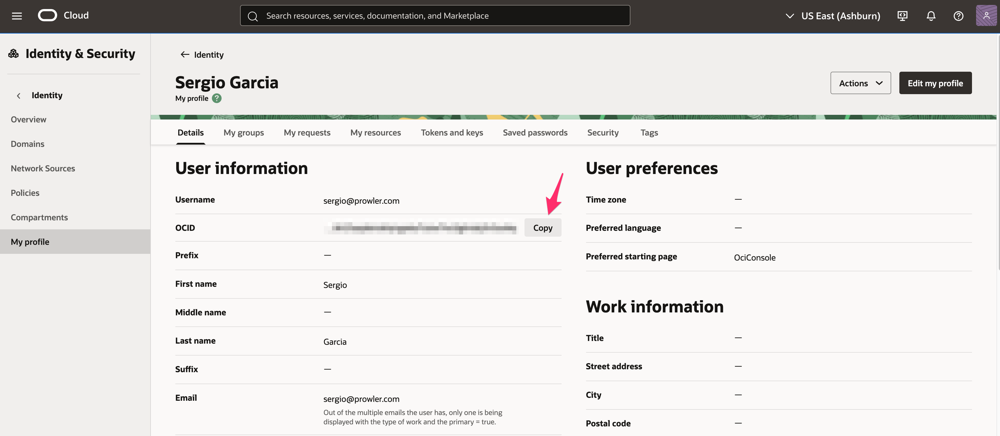

This guide covers all authentication methods supported by Prowler for Oracle Cloud Infrastructure (OCI).

## Authentication Methods

Prowler supports the following authentication methods for OCI:

1. **Config File Authentication** (using `~/.oci/config`)
   - [OCI Session Authentication](#oci-session-authentication) **(Recommended)** - Automatically generates the config file via browser login
   - [Manual API Key Setup](#setting-up-api-keys) - Manually create the config file with static API keys
2. [Instance Principal Authentication](#instance-principal-authentication) - For Prowler running inside OCI compute instances
3. [Environment Variables](#environment-variables) (Limited Support)

**Important Note:** OCI Session Authentication and Manual API Key Setup both use the same config file-based authentication method. The only difference is how the `~/.oci/config` file is generated:
- **Session Authentication**: Automatically created via browser login with temporary session tokens
- **Manual Setup**: You manually generate static API keys and create the config file

## OCI Session Authentication

**This is the recommended method for config file authentication** as it automatically generates the config file and doesn't require managing static API keys.

### Prerequisites

You need to have the **OCI CLI installed** to use session authentication.

For installation instructions, see the [OCI CLI Installation Guide](https://docs.oracle.com/en-us/iaas/Content/API/SDKDocs/cliinstall.htm).

Verify your OCI CLI installation:
```bash
oci --version
```

### How It Works

The `oci session authenticate` command uses your browser to authenticate and creates temporary session tokens that are more secure than static API keys.

### Step 1: Authenticate with OCI Session

```bash
oci session authenticate
```

This command will:
1. Open your default browser
2. Redirect you to OCI Console login
3. Automatically create/update `~/.oci/config` with session tokens
4. Store session credentials securely

### Step 2: Add User OCID to Config File

After running `oci session authenticate`, you need to manually add your user OCID to the config file:

**Get your user OCID from the OCI Console:**

Navigate to: **Identity & Security** → **Users** → Click on your username → Copy the OCID



Direct link: [OCI Console - Users](https://cloud.oracle.com/identity/domains/my-profile)

Or use the OCI CLI:
```bash
oci iam user list --all
```

Edit `~/.oci/config` and add the `user` parameter:

```ini
[DEFAULT]
region=us-ashburn-1
tenancy=ocid1.tenancy.oc1..aaaaaaaexample
fingerprint=11:22:33:44:55:66:77:88:99:aa:bb:cc:dd:ee:ff:11
key_file=/Users/yourusername/.oci/sessions/DEFAULT/oci_api_key.pem
security_token_file=/Users/yourusername/.oci/sessions/DEFAULT/token
user=ocid1.user.oc1..aaaaaaaexample  # Add this line manually
```

### Step 3: Run Prowler

```bash
prowler oci
```

### Advantages of Session Authentication

- **No Manual Key Generation**: No need to generate RSA key pairs manually
- **Automatic Rotation**: Session tokens expire and can be refreshed
- **Browser-Based Login**: Uses your existing OCI Console credentials
- **More Secure**: Temporary credentials reduce the risk of long-term credential exposure

### Session Expiration

Session tokens typically expire after a period of time. When your session expires, simply run:

```bash
oci session authenticate
```

## Config File Authentication (Manual API Key Setup)

If you prefer to manually generate API keys instead of using browser-based session authentication, you can create the config file yourself with static API keys.

**Note:** This method uses the same `~/.oci/config` file as session authentication, but with static API keys instead of temporary session tokens.

### Default Configuration

By default, Prowler uses the OCI configuration file located at `~/.oci/config`.

**Config file structure:**

```ini
[DEFAULT]
user=ocid1.user.oc1..aaaaaaaexample
fingerprint=11:22:33:44:55:66:77:88:99:aa:bb:cc:dd:ee:ff:11
tenancy=ocid1.tenancy.oc1..aaaaaaaexample
region=us-ashburn-1
key_file=~/.oci/oci_api_key.pem
```

**Run Prowler:**

```bash
prowler oci
```

### Multiple Profiles

You can define multiple profiles in your config file:

```ini
[DEFAULT]
user=ocid1.user.oc1..user1
fingerprint=11:22:33:44:55:66:77:88:99:aa:bb:cc:dd:ee:ff:11
tenancy=ocid1.tenancy.oc1..tenancy1
region=us-ashburn-1
key_file=~/.oci/oci_api_key.pem

[PRODUCTION]
user=ocid1.user.oc1..user2
fingerprint=aa:bb:cc:dd:ee:ff:11:22:33:44:55:66:77:88:99:00
tenancy=ocid1.tenancy.oc1..tenancy2
region=us-phoenix-1
key_file=~/.oci/oci_api_key_prod.pem

[DEVELOPMENT]
user=ocid1.user.oc1..user3
fingerprint=99:88:77:66:55:44:33:22:11:00:ff:ee:dd:cc:bb:aa
tenancy=ocid1.tenancy.oc1..tenancy3
region=us-ashburn-1
key_file=~/.oci/oci_api_key_dev.pem
```

**Use a specific profile:**

```bash
prowler oci --profile PRODUCTION
```

### Custom Config File Path

Use a config file from a custom location:

```bash
prowler oci --oci-config-file /path/to/custom/config
```

### Setting Up API Keys

#### Option A: Generate API Key Using OCI Console (Simpler)

1. Log in to OCI Console
2. Navigate to **Identity** → **Users** → Select your user
3. In the **Resources** section, click **API Keys**
4. Click **Add API Key**
5. Select **Generate API Key Pair**
6. Click **Download Private Key** - save this file as `~/.oci/oci_api_key.pem`
7. Click **Add**
8. The console will display a configuration file preview with:
   - `user` OCID
   - `fingerprint`
   - `tenancy` OCID
   - `region`

9. **Copy the entire configuration snippet** from the console and paste it into `~/.oci/config`
10. Add the `key_file` parameter pointing to your downloaded private key:

```ini
[DEFAULT]
user=ocid1.user.oc1..aaaaaaaexample
fingerprint=11:22:33:44:55:66:77:88:99:aa:bb:cc:dd:ee:ff:11
tenancy=ocid1.tenancy.oc1..aaaaaaaexample
region=us-ashburn-1
key_file=~/.oci/oci_api_key.pem  # Add this line
```

11. Set proper permissions:
```bash
chmod 600 ~/.oci/oci_api_key.pem
chmod 600 ~/.oci/config
```

#### Option B: Generate API Key Manually

1. Generate the key pair locally:

```bash
mkdir -p ~/.oci
openssl genrsa -out ~/.oci/oci_api_key.pem 2048
chmod 600 ~/.oci/oci_api_key.pem
openssl rsa -pubout -in ~/.oci/oci_api_key.pem -out ~/.oci/oci_api_key_public.pem
```

2. Upload the public key to OCI Console:
   - Navigate to **Identity** → **Users** → Select your user
   - In the **Resources** section, click **API Keys**
   - Click **Add API Key**
   - Select **Paste Public Key** or **Choose Public Key File**
   - Paste or upload the contents of `~/.oci/oci_api_key_public.pem`
   - Click **Add**

3. The console will display the configuration file preview with your user OCID, fingerprint, tenancy OCID, and region.

4. Copy the configuration snippet from the console and create `~/.oci/config`:

```ini
[DEFAULT]
user=<user_ocid_from_console>
fingerprint=<fingerprint_from_console>
tenancy=<tenancy_ocid_from_console>
region=<region_from_console>
key_file=~/.oci/oci_api_key.pem
```

5. Set proper permissions:
```bash
chmod 600 ~/.oci/config
chmod 600 ~/.oci/oci_api_key.pem
```

#### Test Authentication

After setting up your API keys with either option, test the authentication:

```bash
prowler oci --list-checks
```

## Instance Principal Authentication

Instance Principal authentication allows OCI compute instances to authenticate without storing credentials.

**IMPORTANT:** This authentication method **only works when Prowler is running inside an OCI compute instance**. If you're running Prowler from your local machine or outside OCI, use [OCI Session Authentication](#oci-session-authentication) or [Config File Authentication](#config-file-authentication) instead.

### Prerequisites

1. **Prowler must be running on an OCI compute instance**
2. **Dynamic Group**: Create a dynamic group that includes your compute instance
3. **Policy**: Create policies granting the dynamic group access to resources

### Step 1: Create Dynamic Group

1. Navigate to **Identity** → **Dynamic Groups**
2. Click **Create Dynamic Group**
3. Enter a name (e.g., `prowler-instances`)
4. Add matching rule:
   ```
   instance.compartment.id = 'ocid1.compartment.oc1..example'
   ```
   Or for a specific instance:
   ```
   instance.id = 'ocid1.instance.oc1..example'
   ```

### Step 2: Create Policies

Create a policy allowing the dynamic group to read resources:

```
Allow dynamic-group prowler-instances to inspect all-resources in tenancy
Allow dynamic-group prowler-instances to read all-resources in tenancy
Allow dynamic-group prowler-instances to read audit-events in tenancy
Allow dynamic-group prowler-instances to read cloud-guard-config in tenancy
```

### Step 3: Run Prowler with Instance Principal

On the compute instance, run:

```bash
prowler oci --use-instance-principal
```

### Use Cases for Instance Principal

- **Automated Security Scanning**: Run Prowler on a schedule using cron
- **CI/CD Pipelines**: Integrate security checks in build pipelines
- **Centralized Security Monitoring**: Deploy Prowler on a dedicated security instance

## Environment Variables

While OCI SDK supports environment variables, Prowler currently focuses on config file and instance principal authentication for better security and manageability.

If you need to use environment variables, they will be picked up by the OCI SDK:

```bash
export OCI_CLI_USER=ocid1.user.oc1..example
export OCI_CLI_FINGERPRINT=11:22:33:44:55:66:77:88:99:aa:bb:cc:dd:ee:ff:11
export OCI_CLI_TENANCY=ocid1.tenancy.oc1..example
export OCI_CLI_REGION=us-ashburn-1
export OCI_CLI_KEY_FILE=~/.oci/oci_api_key.pem

prowler oci
```

## Security Best Practices

### API Key Security

1. **Rotate API Keys Regularly**
   - OCI recommends rotating API keys every 90 days
   - Prowler includes a check for this: `identity_user_api_keys_rotated_90_days`

2. **Use Separate Keys Per Environment**
   - Development, staging, and production should use different API keys
   - Use profiles to manage multiple environments

3. **Restrict Key Permissions**
   - Follow the principle of least privilege
   - Grant only read permissions for security auditing

4. **Secure Key Storage**
   ```bash
   chmod 600 ~/.oci/oci_api_key.pem
   chmod 600 ~/.oci/config
   ```

5. **Never Commit Keys to Version Control**
   - Add `~/.oci/` to `.gitignore`
   - Use secret management systems for automation

### Instance Principal Security

1. **Use Specific Compartment Matching**
   ```
   instance.compartment.id = 'specific-compartment-ocid'
   ```
   Instead of:
   ```
   ANY {instance.compartment.id = 'ocid1'}
   ```

2. **Scope Policies Appropriately**
   - Grant access only to required resources
   - Use compartment-level policies when possible

3. **Monitor Dynamic Group Membership**
   - Regularly review which instances belong to security-related dynamic groups
   - Use Cloud Guard to detect anomalous access patterns

## Troubleshooting

### Common Authentication Errors

#### Error: "ConfigFileNotFound"

**Cause**: OCI config file not found at default location

**Solution**:
```bash
# Check if config file exists
ls -la ~/.oci/config

# Create directory if missing
mkdir -p ~/.oci

# Specify custom location
prowler oci --oci-config-file /path/to/config
```

#### Error: "InvalidKeyOrSignature"

**Cause**: Incorrect API key fingerprint or key file

**Solutions**:
1. Verify fingerprint matches OCI Console:
   ```bash
   openssl rsa -pubout -outform DER -in ~/.oci/oci_api_key.pem | \
     openssl md5 -c | \
     awk '{print $2}'
   ```

2. Check key file path in config:
   ```ini
   key_file=~/.oci/oci_api_key.pem  # Use absolute path if needed
   ```

3. Verify key permissions:
   ```bash
   chmod 600 ~/.oci/oci_api_key.pem
   ```

#### Error: "NotAuthenticated"

**Cause**: User OCID, tenancy OCID, or credentials incorrect

**Solutions**:
1. Verify OCIDs in OCI Console
2. Check that API key is uploaded to correct user
3. Ensure user has not been deleted or disabled
4. Test with OCI CLI:
   ```bash
   oci iam region list
   ```

#### Error: "InstancePrincipalNotEnabled"

**Cause**: Instance Principal not configured correctly

**Solutions**:
1. Verify dynamic group includes your instance
2. Check policies grant required permissions
3. Ensure instance is in the correct compartment
4. Test with:
   ```bash
   oci os ns get --auth instance_principal
   ```

### Permission Errors

**Error**: "Authorization failed or requested resource not found"

**Cause**: Insufficient IAM permissions

**Solution**: Add required policies (see [Required Permissions](./getting-started-oci.md#required-permissions))

### Configuration Validation

Validate your OCI configuration:

```bash
# Test OCI CLI connectivity
oci iam region list --profile DEFAULT

# Test with specific profile
oci iam region list --profile PRODUCTION

# Test instance principal
oci iam region list --auth instance_principal
```

## Testing Authentication

Before running a full Prowler scan, test authentication:

```bash
# List available checks (requires authentication)
prowler oci --list-checks

# List available services
prowler oci --list-services

# Test connection only
prowler oci --check identity_password_policy_minimum_length_14 --region us-ashburn-1
```

## Additional Resources

- [OCI SDK Configuration](https://docs.oracle.com/en-us/iaas/Content/API/Concepts/sdkconfig.htm)
- [OCI API Key Management](https://docs.oracle.com/en-us/iaas/Content/Identity/Tasks/managingcredentials.htm)
- [OCI Instance Principals](https://docs.oracle.com/en-us/iaas/Content/Identity/Tasks/callingservicesfrominstances.htm)
- [OCI IAM Policies](https://docs.oracle.com/en-us/iaas/Content/Identity/Concepts/policygetstarted.htm)
