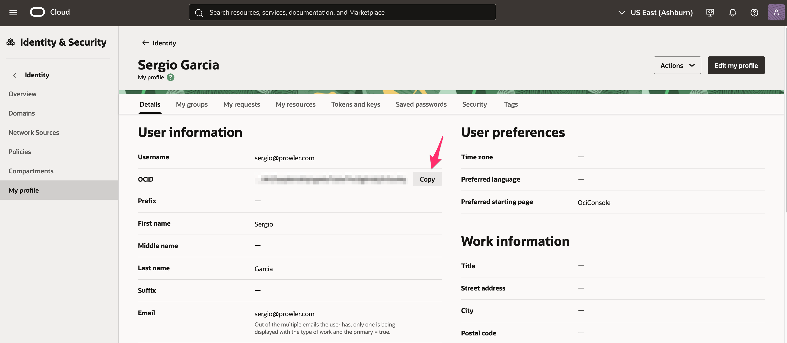

Prowler supports security scanning of Oracle Cloud Infrastructure (OCI) environments. This guide will help you get started with using Prowler to audit your OCI tenancy.

## Prowler Cloud

The following steps apply to Prowler Cloud and the self-hosted Prowler App.

### Step 1: Collect OCI Identifiers
1. Sign in to the [OCI Console](https://cloud.oracle.com/) and open **Tenancy Details** to copy the Tenancy OCID.
2. Go to **Identity & Security** → **Users**, select the principal that owns the API key, and copy the **User OCID**.
3. Generate or locate the API key fingerprint and private key for that user. Follow the [Config File Authentication steps](/user-guide/providers/oci/authentication#config-file-authentication-manual-api-key-setup) to create or rotate the key pair and copy the fingerprint.
4. Note the **Region** identifier to scan (for example, `us-ashburn-1`).

### Step 2: Access Prowler Cloud or Prowler App
1. Navigate to [Prowler Cloud](https://cloud.prowler.com/) or launch [Prowler App](/user-guide/tutorials/prowler-app).
2. Go to **Configuration** → **Cloud Providers** and click **Add Cloud Provider**.

3. Select **Oracle Cloud** and enter the **Tenancy OCID** and an optional alias, then choose **Next**.


### Step 3: Add OCI API Key Credentials
Prowler App connects to OCI with API key credentials. Provide:

- **User OCID** for the API key owner
- **Fingerprint** of the API key
- **Region** (for example, `us-ashburn-1`)
- **Private Key Content** (paste the full PEM value)
- **Passphrase (Optional)** if the private key is encrypted

Select **Next**, then **Launch Scan** to validate the connection and start the first OCI scan. The private key content is encoded for secure transmission.


---

## Prowler CLI

### Prerequisites

Before you begin, ensure you have:

1. **Prowler installed** with OCI dependencies:
   ```bash
   pip install prowler
   # or for development:
   poetry install
   ```

2. **OCI Python SDK** (automatically installed with Prowler):
   ```bash
   pip install oci==2.152.1
   ```

3. **OCI Account Access** with appropriate permissions to read resources in your tenancy.

### Authentication

Prowler supports multiple authentication methods for OCI. For detailed authentication setup, see the [OCI Authentication Guide](./authentication).

**Note:** OCI Session Authentication and Config File Authentication both use the same `~/.oci/config` file. The difference is how the config file is generated - automatically via browser (session auth) or manually with API keys.

#### Quick Start: OCI Session Authentication (Recommended)

The easiest and most secure method is using OCI session authentication, which automatically generates your config file via browser login.

**Prerequisites:** You need to have the **OCI CLI installed**. See the [OCI CLI Installation Guide](https://docs.oracle.com/en-us/iaas/Content/API/SDKDocs/cliinstall.htm) for installation instructions.

1. Authenticate using the OCI CLI:
   ```bash
   oci session authenticate
   ```
   This will open your browser for OCI Console login and automatically generate the config file.

2. Add your user OCID to `~/.oci/config`:

   **Get your user OCID from the OCI Console:**

   Navigate to: **Identity & Security** → **Users** → Click on your username → Copy the OCID

   

   Direct link: [OCI Console - Users](https://cloud.oracle.com/identity/domains/my-profile)

   Or use the OCI CLI:
   ```bash
   oci iam user list --all
   ```

   Edit `~/.oci/config` and add the `user` parameter:
   ```ini
   [DEFAULT]
   region=us-ashburn-1
   tenancy=ocid1.tenancy.oc1..example
   fingerprint=xx:xx:xx:xx:xx:xx:xx:xx:xx:xx:xx:xx:xx:xx:xx:xx
   key_file=/Users/yourusername/.oci/sessions/DEFAULT/oci_api_key.pem
   security_token_file=/Users/yourusername/.oci/sessions/DEFAULT/token
   user=ocid1.user.oc1..example  # Add this line
   ```

3. Run Prowler:
   ```bash
   prowler oci
   ```

#### Alternative: Manual API Key Setup

If you prefer to manually generate API keys instead of using browser-based session authentication, see the detailed instructions in the [Authentication Guide](./authentication#config-file-authentication-manual-api-key-setup).

**Note:** Both methods use the same `~/.oci/config` file - the difference is that manual setup uses static API keys while session authentication uses temporary session tokens.

##### Using a Specific Profile

If you have multiple profiles in your OCI config:

```bash
prowler oci --profile production
```

##### Using a Custom Config File

```bash
prowler oci --oci-config-file /path/to/custom/config
```

#### Instance Principal Authentication

**IMPORTANT:** This authentication method **only works when Prowler is running inside an OCI compute instance**. If you're running Prowler from your local machine, use [OCI Session Authentication](#quick-start-oci-session-authentication-recommended) instead.

When running Prowler on an OCI Compute instance, you can use Instance Principal authentication:

```bash
prowler oci --use-instance-principal
```

**Requirements:**
- **Prowler must be running on an OCI compute instance**
- The compute instance must have a dynamic group and policy allowing access to OCI resources
- Example policy:
  ```
  Allow dynamic-group prowler-instances to inspect all-resources in tenancy
  Allow dynamic-group prowler-instances to read all-resources in tenancy
  ```

### Basic Usage

#### Scan Entire Tenancy

```bash
prowler oci
```

#### Scan Specific Region

```bash
prowler oci --region us-phoenix-1
```

#### Scan Specific Compartments

```bash
prowler oci --compartment-id ocid1.compartment.oc1..example1 ocid1.compartment.oc1..example2
```

#### Run Specific Checks

```bash
prowler oci --check identity_password_policy_minimum_length_14
```

#### Run Specific Services

```bash
prowler oci --service identity network
```

#### Compliance Frameworks

Run CIS OCI Foundations Benchmark v3.0:

```bash
prowler oci --compliance cis_3.0_oci
```

### Required Permissions

Prowler requires **read-only** permissions to audit your OCI tenancy. Below are the minimum required permissions:

#### Tenancy-Level Policy

Create a group `prowler-users` and add your user to it, then create this policy:

```
Allow group prowler-users to inspect all-resources in tenancy
Allow group prowler-users to read all-resources in tenancy
Allow group prowler-users to read audit-events in tenancy
Allow group prowler-users to read cloud-guard-config in tenancy
Allow group prowler-users to read cloud-guard-problems in tenancy
Allow group prowler-users to read cloud-guard-targets in tenancy
```

#### Service-Specific Permissions

For more granular control, you can grant specific permissions:

```
# Identity
Allow group prowler-users to inspect users in tenancy
Allow group prowler-users to inspect groups in tenancy
Allow group prowler-users to inspect policies in tenancy
Allow group prowler-users to inspect authentication-policies in tenancy
Allow group prowler-users to inspect dynamic-groups in tenancy

# Networking
Allow group prowler-users to inspect vcns in tenancy
Allow group prowler-users to inspect subnets in tenancy
Allow group prowler-users to inspect security-lists in tenancy
Allow group prowler-users to inspect network-security-groups in tenancy
Allow group prowler-users to inspect route-tables in tenancy
Allow group prowler-users to inspect dhcp-options in tenancy
Allow group prowler-users to inspect internet-gateways in tenancy
Allow group prowler-users to inspect nat-gateways in tenancy
Allow group prowler-users to inspect service-gateways in tenancy

# Compute
Allow group prowler-users to inspect instances in tenancy
Allow group prowler-users to inspect instance-configurations in tenancy
Allow group prowler-users to inspect boot-volumes in tenancy
Allow group prowler-users to inspect volume-attachments in tenancy

# Storage
Allow group prowler-users to inspect buckets in tenancy
Allow group prowler-users to inspect volumes in tenancy
Allow group prowler-users to inspect file-systems in tenancy

# Database
Allow group prowler-users to inspect autonomous-databases in tenancy
Allow group prowler-users to inspect db-systems in tenancy

# Keys Management
Allow group prowler-users to inspect vaults in tenancy
Allow group prowler-users to inspect keys in tenancy

# Monitoring & Events
Allow group prowler-users to read metrics in tenancy
Allow group prowler-users to inspect alarms in tenancy
Allow group prowler-users to inspect ons-topics in tenancy
Allow group prowler-users to inspect ons-subscriptions in tenancy
Allow group prowler-users to inspect rules in tenancy
```

### Output Formats

Prowler supports multiple output formats for OCI:

#### JSON
```bash
prowler oci --output-formats json
```

#### CSV
```bash
prowler oci --output-formats csv
```

#### HTML
```bash
prowler oci --output-formats html
```

#### Multiple Formats
```bash
prowler oci --output-formats json csv html
```

### Common Scenarios

#### Security Assessment

Full security assessment with CIS compliance:

```bash
prowler oci \
  --compliance cis_3.0_oci \
  --output-formats json html \
  --output-directory ./oci-assessment-$(date +%Y%m%d)
```

#### Continuous Monitoring

Run specific security-critical checks:

```bash
prowler oci \
  --check identity_user_mfa_enabled_console_access \
         network_security_list_ingress_from_internet_to_ssh_port \
         objectstorage_bucket_not_publicly_accessible \
  --output-formats json
```

#### Compartment-Specific Audit

Audit a specific project compartment:

```bash
prowler oci \
  --compartment-id ocid1.compartment.oc1..projecta \
  --profile production \
  --region us-ashburn-1
```

### Troubleshooting

#### Authentication Issues

**Error: "Could not find a valid config file"**
- Ensure `~/.oci/config` exists and is properly formatted
- Verify the path to your API key is correct
- Check file permissions: `chmod 600 ~/.oci/config ~/.oci/oci_api_key.pem`

**Error: "Invalid key or signature"**
- Verify the API key fingerprint matches the one in OCI Console
- Ensure the public key is uploaded to your OCI user account
- Check that the private key file is accessible

#### Permission Issues

**Error: "Authorization failed or requested resource not found"**
- Verify your user has the required policies (see [Required Permissions](#required-permissions))
- Check that policies apply to the correct compartments
- Ensure policies are not restricted by conditions that exclude your user

#### Region Issues

**Error: "Invalid region"**
- Check available regions: `prowler oci --list-regions`
- Verify your tenancy is subscribed to the region
- Use the region identifier (e.g., `us-ashburn-1`), not the display name

### Advanced Usage

#### Using Mutelist

Create a mutelist file to suppress specific findings:

```yaml
# oci-mutelist.yaml
Tenancies:
  - "ocid1.tenancy.oc1..example":
      Checks:
        "identity_password_policy_*":
          Regions:
            - "us-ashburn-1"
          Resources:
            - "ocid1.user.oc1..example"
```

Run with mutelist:

```bash
prowler oci --mutelist-file oci-mutelist.yaml
```

#### Custom Checks Metadata

Override check metadata:

```yaml
# custom-metadata.yaml
identity_user_mfa_enabled_console_access:
  Severity: critical
  CheckTitle: "Custom: Ensure MFA is enabled for all console users"
```

Run with custom metadata:

```bash
prowler oci --custom-checks-metadata-file custom-metadata.yaml
```

#### Filtering by Status

Only show failed checks:

```bash
prowler oci --status FAIL
```

#### Filtering by Severity

Only show critical and high severity findings:

```bash
prowler oci --severity critical high
```

### Next Steps

- Learn about [Compliance Frameworks](/user-guide/cli/tutorials/compliance) in Prowler
- Review [Prowler Output Formats](/user-guide/cli/tutorials/reporting)
- Explore [Integrations](/user-guide/cli/tutorials/integrations) with SIEM and ticketing systems

### Additional Resources

- [OCI Documentation](https://docs.oracle.com/en-us/iaas/Content/home.htm)
- [CIS OCI Foundations Benchmark](https://www.cisecurity.org/benchmark/oracle_cloud)
- [Prowler Documentation](https://docs.prowler.com)
- [Prowler GitHub](https://github.com/prowler-cloud/prowler)
