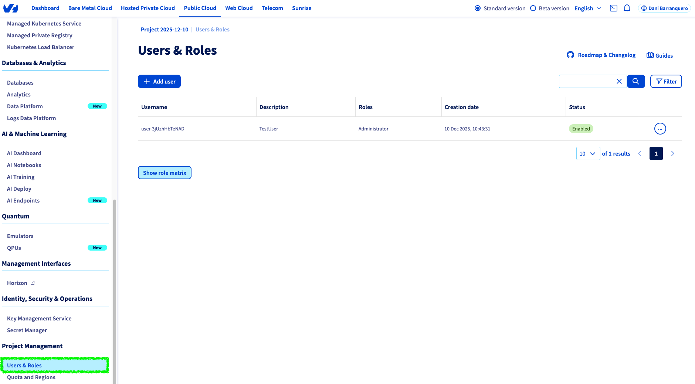
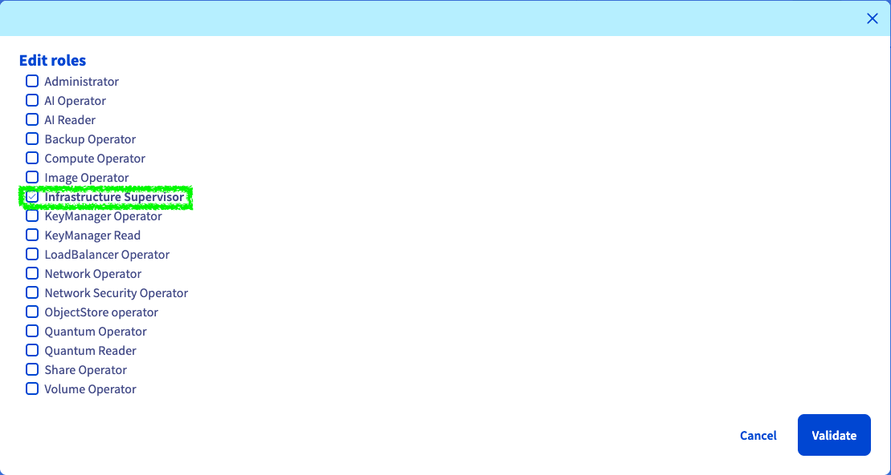
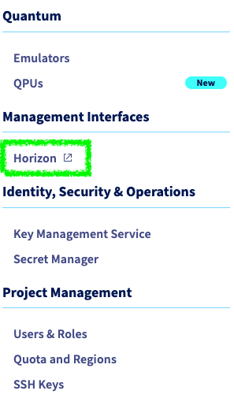
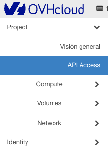
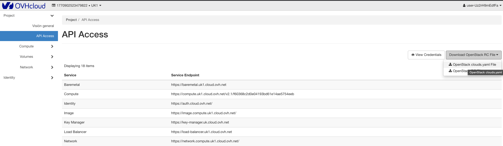

<Warning>
Prowler currently supports **public cloud OpenStack providers** (OVH, Infomaniak, Vexxhost, etc.). Support for self-deployed OpenStack environments is not yet available and will be added in future releases.
</Warning>

This guide shows how to obtain OpenStack credentials and configure Prowler to scan your OpenStack infrastructure using the recommended `clouds.yaml` authentication method.

## Quick Start: Getting Your OpenStack Credentials

<Tabs>
  <Tab title="OVH">
    ### Step 1: Create an OpenStack User with Reader Role

    Before using Prowler, create a dedicated user in your OVH Public Cloud account:

    1. Log into the [OVH Control Panel](https://www.ovh.com/manager/)
    2. Navigate to "Public Cloud" → Select your project
    3. Click "Users & Roles" in the left sidebar

    

    4. Click "Add User"
    5. Enter a user description (e.g., `Prowler Audit User`)
    6. Assign the "Infrastructure Supervisor" role (this is the reader role) or specific read-only operator roles (if needed to audit only specific services)

    

    7. Click "Generate" to create the user
    8. Copy the password and store it securely

    <Warning>
    Avoid using administrator or member roles for security auditing. Reader or operator roles provide sufficient access for Prowler while maintaining security best practices.
    </Warning>

    ### Step 2: Access the Horizon Dashboard

    1. From the OVH Control Panel, go to "Public Cloud" → Your project
    2. Click "Horizon" in the left sidebar (or access the Horizon URL provided by OVH)

    

    3. Log in with the user credentials created in Step 1. Ensure the correct user is selected; logging in with the root user will download root user credentials. If the wrong user is logged in, log out and log in again with the correct user.

    ### Step 3: Navigate to API Access

    Once logged into Horizon:

    1. In the left sidebar, click "Project"
    2. Navigate to "API Access"

    

    3. You'll see the API Access page with information about your OpenStack endpoints

    ### Step 4: Download the clouds.yaml File

    The `clouds.yaml` file contains all necessary credentials in the correct format for Prowler:

    1. On the API Access page, look for the "Download OpenStack RC File" dropdown button
    2. Click the dropdown and select "OpenStack clouds.yaml File"

    

    3. The file will be downloaded to your computer

    <Note>
    The clouds.yaml file contains your password in plain text. Ensure you store it securely with appropriate file permissions (see [Security Best Practices](#security-best-practices) below).
    </Note>

    ### Step 5: Configure clouds.yaml for Prowler

    Save the file to the default OpenStack configuration directory:

    ```bash
    # Create the directory if it doesn't exist
    mkdir -p ~/.config/openstack

    # Move or copy the downloaded clouds.yaml file
    mv ~/Downloads/clouds.yaml ~/.config/openstack/clouds.yaml

    # Set secure file permissions
    chmod 600 ~/.config/openstack/clouds.yaml
    ```

    The downloaded file will look similar to this:

    ```yaml
    clouds:
      openstack:
        auth:
          auth_url: https://auth.cloud.ovh.net/v3
          username: user-xxxxxxxxxx
          password: your-password-here
          project_id: your-project-id
          project_name: your-project-name
          user_domain_name: Default
          project_domain_name: Default
        region_name: GRA7
        interface: public
        identity_api_version: 3
    ```

    You can customize the cloud name (e.g., change `openstack` to `ovh-production`):

    ```yaml
    clouds:
      ovh-production:
        auth:
          auth_url: https://auth.cloud.ovh.net/v3
          username: user-xxxxxxxxxx
          password: your-password-here
          project_id: your-project-id
          user_domain_name: Default
          project_domain_name: Default
        region_name: GRA7
        identity_api_version: "3"
    ```

    Alternatively, save the file to a custom location and specify the path when running Prowler:

    ```bash
    # Save the clouds.yaml file to a custom location
    mv ~/Downloads/clouds.yaml /path/to/my/clouds.yaml

    # Set secure file permissions
    chmod 600 /path/to/my/clouds.yaml
    ```

    ### Step 6: Run Prowler

    Now you can scan your OVH OpenStack infrastructure:

    **Using the default location:**
    ```bash
    prowler openstack --clouds-yaml-cloud openstack
    ```

    Or if you customized the cloud name:
    ```bash
    prowler openstack --clouds-yaml-cloud ovh-production
    ```

    **Using a custom location:**
    ```bash
    prowler openstack --clouds-yaml-file /path/to/my/clouds.yaml --clouds-yaml-cloud openstack
    ```

    Prowler will authenticate with your OVH OpenStack cloud and begin scanning.
  </Tab>

  <Tab title="Generic Public Cloud">
    ### Step 1: Create an OpenStack User with Reader Role

    Before using Prowler, create a dedicated user in your OpenStack public cloud account. The exact steps vary by provider (Infomaniak, Vexxhost, Fuga Cloud, etc.), but the general process is:

    1. Log into your provider's control panel or management interface
    2. Navigate to your OpenStack project or account settings
    3. Find the user management section (typically named "Users", "Users & Roles", or "Access Management")
    4. Create a new user (e.g., `prowler-audit`)
    5. Assign the **Reader** role or equivalent read-only role to the user:
       - **Reader**: Standard read-only access to all resources
       - **Viewer**: Alternative read-only role (in some deployments)
       - Avoid **Member** or **Admin** roles for security auditing
    6. Save the credentials (username and password) securely

    <Warning>
    Avoid using administrator or member roles for security auditing. Reader or Viewer roles provide sufficient access for Prowler while maintaining security best practices.
    </Warning>

    <Note>
    Consult the provider's documentation for specific instructions on creating users and assigning roles. Consider contributing by opening an issue or pull request with instructions for additional providers.
    </Note>

    ### Step 2: Access the Horizon Dashboard

    Horizon is the standard OpenStack web interface available across all OpenStack providers:

    1. Find the Horizon dashboard link in your provider's control panel
       - Look for "OpenStack Dashboard", "Horizon", "Web Console", or similar
    2. Access the Horizon URL (typically `https://your-provider-domain/horizon` or similar)
    3. Log in with the user credentials created in Step 1

    <Note>
    The Horizon dashboard interface is standardized across OpenStack providers, though branding and colors may vary. The navigation and functionality remain consistent.
    </Note>

    ### Step 3: Navigate to API Access

    Once logged into Horizon:

    1. In the left sidebar, click "Project"
    2. Navigate to "API Access"
    3. You'll see the API Access page with information about your OpenStack endpoints

    ### Step 4: Download the clouds.yaml File

    The `clouds.yaml` file contains all necessary credentials in the correct format for Prowler:

    1. On the API Access page, look for the "Download OpenStack RC File" dropdown button
    2. Click the dropdown and select "OpenStack clouds.yaml File"
    3. The file will be downloaded to your computer

    <Note>
    The clouds.yaml file contains your password in plain text. Ensure you store it securely with appropriate file permissions (see [Security Best Practices](#security-best-practices) below).
    </Note>

    ### Step 5: Configure clouds.yaml for Prowler

    Save the file to the default OpenStack configuration directory:

    ```bash
    # Create the directory if it doesn't exist
    mkdir -p ~/.config/openstack

    # Move or copy the downloaded clouds.yaml file
    mv ~/Downloads/clouds.yaml ~/.config/openstack/clouds.yaml

    # Set secure file permissions
    chmod 600 ~/.config/openstack/clouds.yaml
    ```

    The downloaded file will look similar to this (values will vary by provider):

    ```yaml
    clouds:
      openstack:
        auth:
          auth_url: https://auth.example-cloud.com:5000/v3
          username: user-xxxxxxxxxx
          password: your-password-here
          project_id: your-project-id
          project_name: your-project-name
          user_domain_name: Default
          project_domain_name: Default
        region_name: RegionOne
        interface: public
        identity_api_version: 3
    ```

    You can customize the cloud name (e.g., change `openstack` to `infomaniak-production`):

    ```yaml
    clouds:
      infomaniak-production:
        auth:
          auth_url: https://api.pub1.infomaniak.cloud/identity/v3
          username: user-xxxxxxxxxx
          password: your-password-here
          project_id: your-project-id
          user_domain_name: Default
          project_domain_name: Default
        region_name: dc3-a
        identity_api_version: "3"
    ```

    Alternatively, save the file to a custom location and specify the path when running Prowler:

    ```bash
    # Save the clouds.yaml file to a custom location
    mv ~/Downloads/clouds.yaml /path/to/my/clouds.yaml

    # Set secure file permissions
    chmod 600 /path/to/my/clouds.yaml
    ```

    ### Step 6: Run Prowler

    Now you can scan your OpenStack infrastructure:

    **Using the default location:**
    ```bash
    prowler openstack --clouds-yaml-cloud openstack
    ```

    Or if you customized the cloud name:
    ```bash
    prowler openstack --clouds-yaml-cloud infomaniak-production
    ```

    **Using a custom location:**
    ```bash
    prowler openstack --clouds-yaml-file /path/to/my/clouds.yaml --clouds-yaml-cloud openstack
    ```

    Prowler will authenticate with your OpenStack cloud and begin scanning.
  </Tab>
</Tabs>

## Managing Multiple OpenStack Environments

To scan multiple OpenStack projects or providers, add multiple cloud configurations to your `clouds.yaml`:

```yaml
clouds:
  ovh-production:
    auth:
      auth_url: https://auth.cloud.ovh.net/v3
      username: user-prod
      password: prod-password
      project_id: prod-project-id
      user_domain_name: Default
      project_domain_name: Default
    region_name: GRA7
    identity_api_version: "3"

  ovh-staging:
    auth:
      auth_url: https://auth.cloud.ovh.net/v3
      username: user-staging
      password: staging-password
      project_id: staging-project-id
      user_domain_name: Default
      project_domain_name: Default
    region_name: SBG5
    identity_api_version: "3"

  infomaniak-production:
    auth:
      auth_url: https://api.pub1.infomaniak.cloud/identity/v3
      username: infomaniak-user
      password: infomaniak-password
      project_id: infomaniak-project-id
      user_domain_name: Default
      project_domain_name: Default
    region_name: dc3-a
    identity_api_version: "3"
```

Then scan each environment separately:

```bash
prowler openstack --clouds-yaml-cloud ovh-production --output-directory ./reports/ovh-prod/
prowler openstack --clouds-yaml-cloud ovh-staging --output-directory ./reports/ovh-staging/
prowler openstack --clouds-yaml-cloud infomaniak-production --output-directory ./reports/infomaniak/
```

## Creating a User With Reader Role

For security auditing, Prowler only needs **read-only access** to your OpenStack resources.

### Understanding OpenStack Roles

OpenStack uses a role-based access control (RBAC) system. Common read-only roles include:

| Role | Access Level | Recommended for Prowler |
|------|--------------|------------------------|
| **Reader** | Read-only access to all resources | ✅ **Recommended** |
| **Viewer** | Read-only access (older deployments) | ✅ **Recommended** |
| **Compute/Network/ObjectStore Operator** | Service-specific read-only access | ✅ **Recommended** (OVH) |
| **Member** | Read and limited write access | ⚠️ Too permissive |
| **Admin** | Full administrative access | ❌ **Not recommended** |

<Warning>
Avoid using administrator or member roles for security auditing. Reader or Viewer roles provide sufficient access for Prowler while maintaining security best practices.
</Warning>

### How to Assign the Reader Role

The process for creating a user with the Reader role is covered in the [Quick Start](#quick-start-getting-your-openstack-credentials) section above. Select your provider's tab (OVH or Generic Public Cloud) for detailed instructions.

### Verifying Read-Only Access

After assigning read-only roles, verify the user cannot make changes:

1. Log into Horizon with the Prowler user credentials
2. Attempt to create or modify a resource (e.g., create an instance)
3. The action should be denied or the UI should show read-only mode

<Note>
Some OpenStack deployments may use custom role names. Consult your OpenStack administrator to identify the appropriate read-only role for your environment.
</Note>

## Alternative Authentication Methods

While `clouds.yaml` is the recommended method, Prowler also supports these alternatives:

### Environment Variables

Set OpenStack credentials as environment variables:

```bash
export OS_AUTH_URL="https://openstack.example.com:5000/v3"
export OS_USERNAME="prowler-audit"
export OS_PASSWORD="your-secure-password"
export OS_PROJECT_ID="your-project-id"
export OS_REGION_NAME="RegionOne"
export OS_IDENTITY_API_VERSION="3"
export OS_USER_DOMAIN_NAME="Default"
export OS_PROJECT_DOMAIN_NAME="Default"
```

Then run Prowler:

```bash
prowler openstack
```

### Command-Line Arguments (Flags)

Pass credentials directly via CLI flags:

```bash
prowler openstack \
  --os-auth-url https://openstack.example.com:5000/v3 \
  --os-username prowler-audit \
  --os-password your-secure-password \
  --os-project-id your-project-id \
  --os-user-domain-name Default \
  --os-project-domain-name Default \
  --os-identity-api-version 3
```

<Warning>
Avoid passing passwords via command-line arguments in production environments. Commands may appear in shell history, process listings, or logs. Use `clouds.yaml` or environment variables instead.
</Warning>

## Authentication Priority

When multiple authentication methods are configured, Prowler uses this priority order:

1. **clouds.yaml** (if `--clouds-yaml-file` or `--clouds-yaml-cloud` is provided)
2. **Command-line arguments + Environment variables** (CLI arguments override environment variables)

## Security Best Practices

### File Permissions

Protect your `clouds.yaml` file from unauthorized access:

```bash
# Set read/write for owner only
chmod 600 ~/.config/openstack/clouds.yaml

# Verify permissions
ls -la ~/.config/openstack/clouds.yaml
# Should show: -rw------- (600)
```

### Credential Management

- **Use dedicated audit users**: Create separate OpenStack users specifically for Prowler audits
- **Use read-only roles**: Assign only Reader or Viewer roles to limit access
- **Rotate credentials regularly**: Change passwords and regenerate credentials periodically
- **Use Application Credentials**: For advanced setups, use OpenStack Application Credentials with scoped permissions and expiration dates
- **Avoid hardcoding passwords**: Never commit `clouds.yaml` files with passwords to version control
- **Use secrets managers**: For production environments, consider using tools like HashiCorp Vault or AWS Secrets Manager to store credentials

### Network Security

- **Use HTTPS**: Always connect to OpenStack endpoints via HTTPS
- **Verify SSL certificates**: Avoid using `--insecure` flag in production
- **Restrict network access**: Use firewall rules to limit access to OpenStack APIs
- **Use VPN or private networks**: When possible, run Prowler from within your private network

## Troubleshooting

### "Missing mandatory OpenStack environment variables" Error

This error occurs when required credentials are not configured:

```bash
# Check current environment variables
env | grep OS_

# Verify clouds.yaml exists and is readable
cat ~/.config/openstack/clouds.yaml
```

**Solution**: Ensure all required credentials are configured using one of the authentication methods above.

### "Failed to create OpenStack connection" Error

This error indicates authentication failure. Verify:

- ✅ Auth URL is correct and accessible: `curl -k https://auth-url/v3`
- ✅ Username and password are correct
- ✅ Project ID exists and you have access
- ✅ Network connectivity to the OpenStack endpoint
- ✅ SSL/TLS certificates are valid

**Solution**: Test authentication using the OpenStack CLI:

```bash
openstack --os-cloud openstack server list
```

If this fails, your credentials or network connectivity need attention.

### "Cloud 'name' not found in clouds.yaml" Error

This error occurs when the specified cloud name doesn't exist in `clouds.yaml`:

**Solution**:
- Verify the cloud name matches exactly (case-sensitive)
- Check your `clouds.yaml` file for the correct cloud name:
  ```bash
  cat ~/.config/openstack/clouds.yaml
  ```
- Ensure proper YAML syntax (use a YAML validator if needed)

### Permission Denied Errors

If specific checks fail due to insufficient permissions:

1. Verify role assignments:
   ```bash
   openstack role assignment list --user prowler-audit --project your-project
   ```

2. Ensure the user has Reader or Viewer roles

3. Check if specific services require additional permissions (consult your OpenStack administrator)

<Warning>
Using Public Cloud credentials can limit Keystone API access, so the command above may not work. Verify permissions in the provider's control panel instead.
</Warning>

## Next Steps

- [Getting Started with OpenStack](/user-guide/providers/openstack/getting-started-openstack) - Run your first scan
- [Mutelist](/user-guide/cli/tutorials/mutelist) - Suppress known findings and false positives

## Additional Resources

### Provider-Specific Documentation

- **OVH Public Cloud**: [OpenStack Documentation](https://help.ovhcloud.com/csm/en-gb-documentation-public-cloud-cross-functional?id=kb_browse_cat&kb_id=574a8325551974502d4c6e78b7421938&kb_category=32a89dbc81ef5a581e11e4879ea7a52b&spa=1)

### OpenStack References

- [OpenStack Documentation](https://docs.openstack.org/)
- [OpenStack Security Guide](https://docs.openstack.org/security-guide/)
- [clouds.yaml Format](https://docs.openstack.org/python-openstackclient/latest/configuration/index.html)
