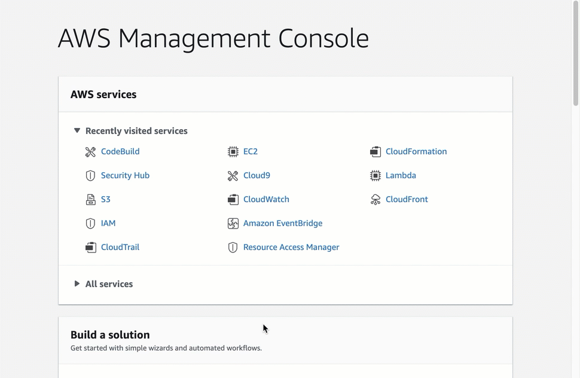

# Install Security Baseline Kickstarter with Prowler

## Introduction

The following demonstartes how to quickly install the resources necessary to perform a baseline using Prowler.  The speed is based on the prebuilt terraform script that can configure all the resources necessuary to run Prowler with the findings being sent to AWS Security Hub.

  


## Install

Installing Prowler with Terraform is simple and can be completed in under 1 minute.

- Start AWS CloudShell
- Run the following commands to install Terraform and clone the repo
  ```
  git clone https://github.com/singergs/prowler.git
  git fetch
  cd prowler
  git checkout -t origin/terraform-kickstart
  sudo yum install -y yum-utils
  sudo yum-config-manager --add-repo https://rpm.releases.hashicorp.com/AmazonLinux/hashicorp.repo
  sudo yum -y install terraform
  cd terraform-kickstart
  ```
- Issue a `terraform init`
  
- Issue a `terraform apply`
  
   - It is likely an error will return related to the SecurityHub subscription.  This appears to be Terraform related and you can validate the configuration by navigating to the SecurityHub console.  Click Integreations and search for Prowler. Take noe of the green check where it says *Accepting findings*
  
  

- Re-Issue a `terraform apply` to ensure all IAM roles have been configured successfully

## Resources

| Name | Type |
|------|------|
| [aws_cloudwatch_event_rule.prowler_check_scheduler_event](https://registry.terraform.io/providers/hashicorp/aws/latest/docs/resources/cloudwatch_event_rule) | resource |
| [aws_cloudwatch_event_target.run_prowler_scan](https://registry.terraform.io/providers/hashicorp/aws/latest/docs/resources/cloudwatch_event_target) | resource |
| [aws_codebuild_project.prowler_codebuild](https://registry.terraform.io/providers/hashicorp/aws/latest/docs/resources/codebuild_project) | resource |
| [aws_iam_policy.prowler_event_trigger_policy](https://registry.terraform.io/providers/hashicorp/aws/latest/docs/resources/iam_policy) | resource |
| [aws_iam_policy.prowler_kickstarter_iam_policy](https://registry.terraform.io/providers/hashicorp/aws/latest/docs/resources/iam_policy) | resource |
| [aws_iam_policy_attachment.prowler_event_trigger_policy_attach](https://registry.terraform.io/providers/hashicorp/aws/latest/docs/resources/iam_policy_attachment) | resource |
| [aws_iam_policy_attachment.prowler_kickstarter_iam_policy_attach](https://registry.terraform.io/providers/hashicorp/aws/latest/docs/resources/iam_policy_attachment) | resource |
| [aws_iam_role.prowler_event_trigger_role](https://registry.terraform.io/providers/hashicorp/aws/latest/docs/resources/iam_role) | resource |
| [aws_iam_role.prowler_kick_start_role](https://registry.terraform.io/providers/hashicorp/aws/latest/docs/resources/iam_role) | resource |
| [aws_s3_bucket.prowler_report_storage_bucket](https://registry.terraform.io/providers/hashicorp/aws/latest/docs/resources/s3_bucket) | resource |
| [aws_s3_bucket_policy.prowler_report_storage_bucket_policy](https://registry.terraform.io/providers/hashicorp/aws/latest/docs/resources/s3_bucket_policy) | resource |
| [aws_s3_bucket_public_access_block.prowler_report_storage_bucket_block_public](https://registry.terraform.io/providers/hashicorp/aws/latest/docs/resources/s3_bucket_public_access_block) | resource |
| [aws_securityhub_account.securityhub_resource](https://registry.terraform.io/providers/hashicorp/aws/latest/docs/resources/securityhub_account) | resource |
| [aws_securityhub_product_subscription.security_hub_enable_prowler_findings](https://registry.terraform.io/providers/hashicorp/aws/latest/docs/resources/securityhub_product_subscription) | resource |
| [aws_caller_identity.current](https://registry.terraform.io/providers/hashicorp/aws/latest/docs/data-sources/caller_identity) | data source |
| [aws_iam_policy.SecurityAudit](https://registry.terraform.io/providers/hashicorp/aws/latest/docs/data-sources/iam_policy) | data source |
| [aws_region.current](https://registry.terraform.io/providers/hashicorp/aws/latest/docs/data-sources/region) | data source |
